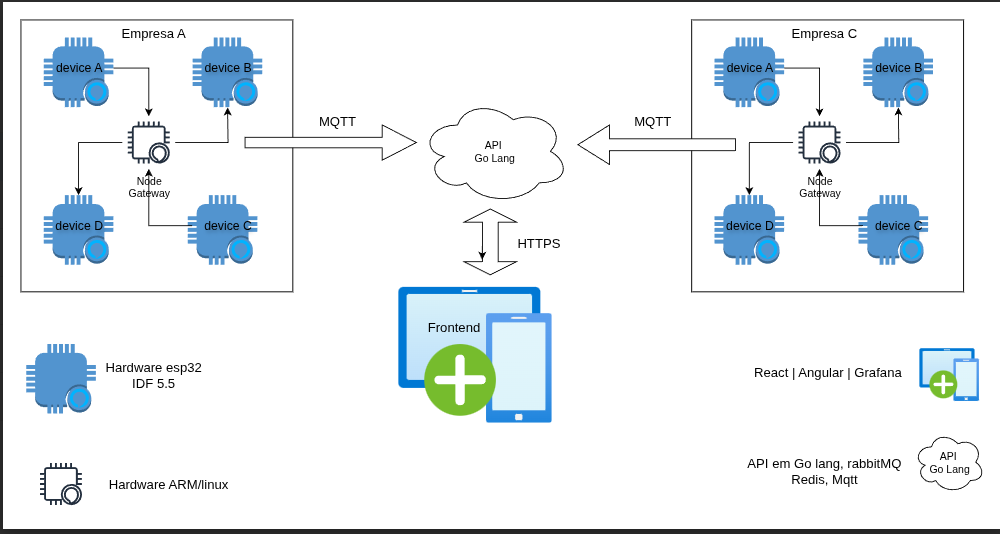

# Sistema de supervisor de dispositivos IoT

### Intencão do projeto

O projeto visa criar um sistema de supervisor de dispositivos IoT Industriais, que irá receber as mensagens de telemetria e enviar as mensagens de comando para os dispositivos IoT.

## Modelo de infraestrutura

### Alvo para supervisão

Instalação de equipamentos industriais, acessórios de segurança, quadros elétricos, etc.

### Esse projeto é dividido em 3 partes, essas partes/etapas tem subitens.

1. API em Go Lang
   - MQTT com etapa de autenticação e autorização
   - rabbitmq
   - redis
   - postgresql

2. Devices de monitoramento ou `Devices de telemetria` 
   - Gateway
   - Dispositivos IoT com sensor diversos, temperatura, umidade, luminosidade, corrente, tensão, eixos, vibração.

Os dispositivos IoT ira enviar as mensagens de telemetria para o gateway, que ira enviar as mensagens para a API em Go Lang.

3. Frontend
   - Angular | React
   - Dashboard
   - Grafana

### Regras de negocio fundamentais

- 1 Os dispositivos IoT irão enviar mensagens para o gateway.
- 2 Gateway se conecta ao broker MQTT e envia as mensagens para a `API`.
- 3 `API` faz autenticacao e autorizacao das mensagens recebidas do gateway.
- 4 `API` processa as mensagens recebidas do gateway aplicando as regras de negocio.
- 5 `API` envia as mensagens de comando para o gateway avisando o recebimento das mensagens de telemetria.
- 6 `API` encaminha as mensagens processadas para o RabbitMQ.
- 7 `API` salva as mensagens de telemetria no postgresql.
- 8 `API` expoe endpoints para consulta das mensagens de telemetria para o frontend.

## Desenvolvimento dos dispositivos IoT

Dispositivo de `ponta` que é parte que vai coletar grandezas do sensores.

- 1 Controlador principal `esp32-s3`
- 2 Sensores
- 3 Comunicação via `ESP-Now` com `Gateway`
- 4 Fonte de energia `em avaliacão`
- 5 Software de cad `kicad 8`
- 6 Software de programação `ESP-IDF 5.5`
- 7 Hardware de programação `ESP-PROG`

Dispositivo master ou `Gateway`

- 1 Processador princiapal `arm-v7` com `linux` ou `openwrt`
- 2 Fonte de energia `em avaliacão`
- 3 Software de cad `kicad 8`
- 4 Software de programação `yocto-project`
- esp32-s3 para comunicação com `dispositivo de telemetria` via `ESP-Now`
- 5 Hardware de programação `ESP-PROG`
